# JavaScript Quiz

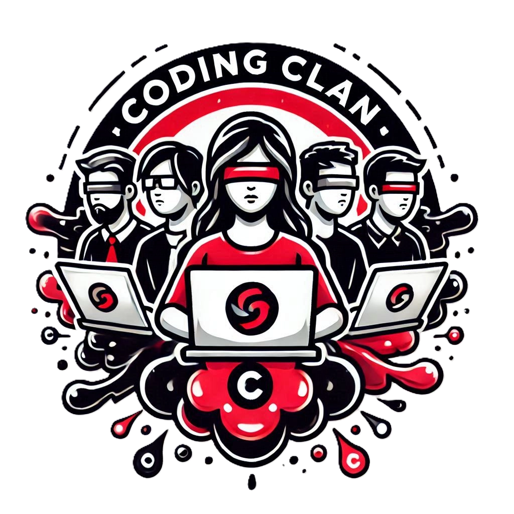

## Purpose

The purpose of JavaScript Quiz is for beginner-level JavaScript users to test their knowledge of JavaScript code. The site encourages repeated usage to help grow users retention of key JavaScript concepts as well as promising harder difficulty levels in future releases.

The live site can be accessed via this [link](https://charlestack.github.io/JavaScriptQuiz/).
The GitHub repository can be accessed [here](https://github.com/CharlesTack/JavaScriptQuiz).

## User Stories
We used 16 user stories, divided into 8 “must-haves”, 3 “should-haves”, 3 “could-haves” and 2 “won’t-haves”.  The “must-have” user stories used were:
- As a user, I want the quiz to present 10 randomly selected questions from the chosen difficulty level so that each quiz attempt feels unique.
- As a user, I want to see four multiple choice answers for each question so that I can select the correct one.
- As a regular quiz user I want to be presented with a single screen quiz which is familiar, intuitive and logical in layout to me so that I can easily operate the quiz and navigate the site.
- As a user who has multiple devices I want the site to look as good as possible on a variety of different screen sizes, preferably on a single screen on each, so that I can have the best user experience.
- As a user I want to use a site which has been well tested and free from bugs, as well as having good colour contrast for ease of visibility so that I can have a great user experience.
- As a user, I need the site to be well thought out and designed with the site user in mind, with the processes used to indicate such so that I can have the best user experience.
- As a user of the site I expect modern tools to be used in the creation and development of the site so that I get user best user experience.
- As a fellow coder I would like to see the development documentation and marked up comments on the code so that I can get a better insight into the process and understanding of the code.

## Features
### Instructions Button
- Towards the top of the screen there is an “Instructions” button which pops up a modal window with detailed instructions on how to operate the quiz. 

### Start Quiz Button
- The quiz gives you a random question immediately and has simplified controls.
  
### Automatic Next Question
- After answering a question, there is a brief pause (1 second) and the next question is then presented.

### Colour Coded Feedback
- Feedback is given to the user after each question is answered via colours - the answers will go red if incorrect or green if correct.

### Completion Message
- Upon completion of the quiz, the user will be presented with their final score and confirmation that the quiz has completed.

### Reset Button
- Upon completion of the quiz, the user will have the option to restart the quiz via a reset button.

### Question Number and Score Areas
- The user’s progress and current score is displayed on screen.

### Use of Media Query to control button width on larger screens
- We used a media query to prevent the top level buttons from spreading too far apart, beyond the outer margins/edges of the main element containers.

## Technologies used

- [HTML](https://codeinstitute.net/blog/what-is-html-and-why-should-i-learn-it/)
- [CSS](https://codeinstitute.net/blog/what-is-css-and-why-should-i-learn-it/)
- [Bootstrap](https://getbootstrap.com/)
- [JavaScript](https://codeinstitute.net/blog/what-is-javascript-and-why-should-i-learn-it/)
- [Balsamiq](https://balsamiq.com/)
- [GitHub](https://github.com/)
- [Microsoft Copilot](https://copilot.microsoft.com/)
- [Miro](https://miro.com//)

## Design & Planning
- AI tools were used for image creation (Copilot and Photoshop), though only the Copilot image was used for the group logo.  Multiple stock image sites were reviewed to get a suitable JavaScript related background image.  An image from StockSnap was selected and is credited below.

- Boxes with semi-transparent grey background colours were used with white text to ensure good colour contrast.  Answer buttons are white with black text to stand out more against the other elements.

- The font "Orbitron" was selected for its technological and futuristic appearance which fitted with the theme of coding. Standard sans-serif font was used for non-heading elements due to its universal usage and ease of reading.

- We used Miro to assist with planning and for documenting the development of the site.  The Miro Board can be found [here](https://miro.com/welcomeonboard/WFBLUjM1Q0U4T3FCYWxrVkluSDExd3FScExCaWx5aUZGbk1XNFdsTWk2TE9FV1JkbHlxMW1qME5nUENIcVpHMEFObmhLQWZiYlVZeWVMcXdYRXJqM3h5cng3K2grZ0llM0dBSXNjaGNkSTFTTS85S0k1U1VCZXJCQXAxV1BaRkshZQ==?share_link_id=428969829822).

### Wireframes
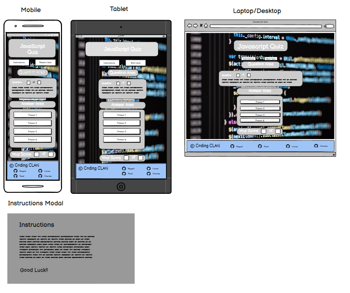
[Wireframe for JavaScript Quiz](assets/images/wireframes/JSQuizWireframes.bmpr)

## Testing
Manual and automatic testing has been carried out extensively.
Tools used for automatic testing have been:
- Copilot
- Google Chrome DevTools
- Lighthouse
- JSHint
- W3 Tools (HTML & CSS Validators)
- Testing across different browsers
- AIM Contrast Checks
- User testing and feedback

### Results:
The site experienced a couple of errors initially which have since been corrected and evidenced in the screenshots below.

### W3 HTML:
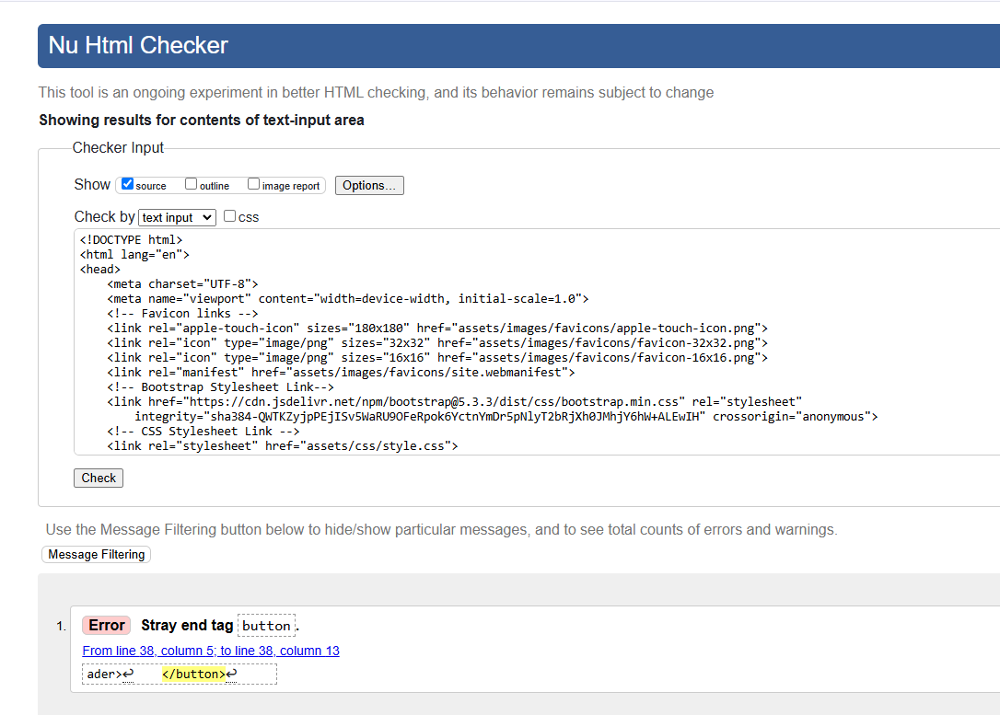
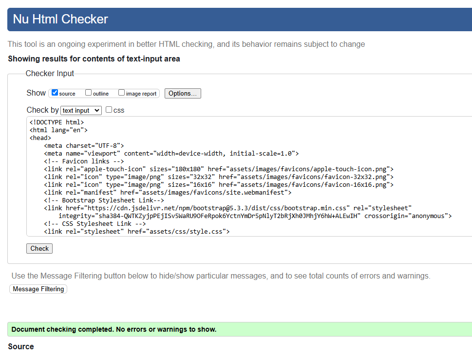

### W3 CSS:
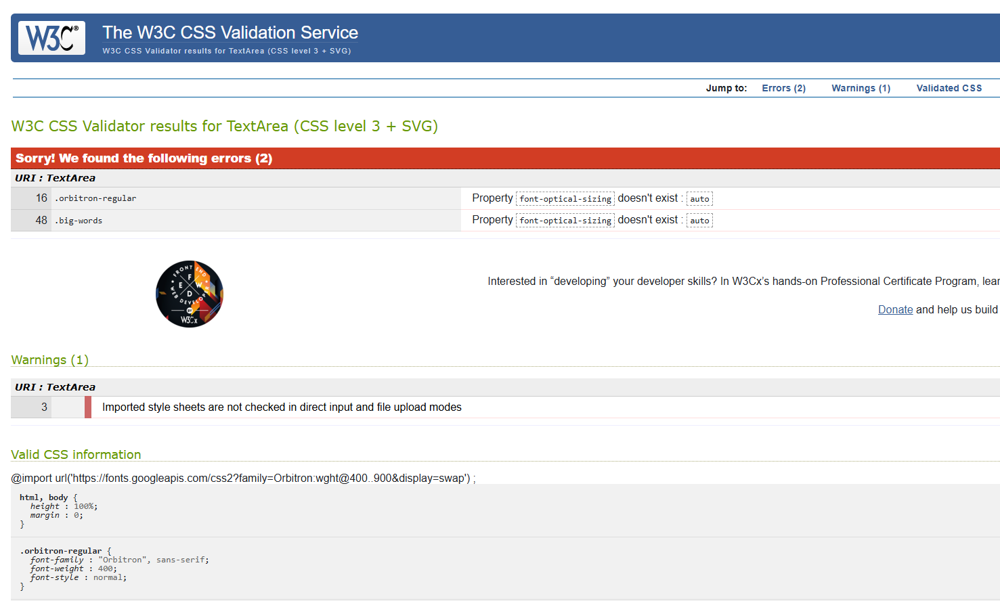
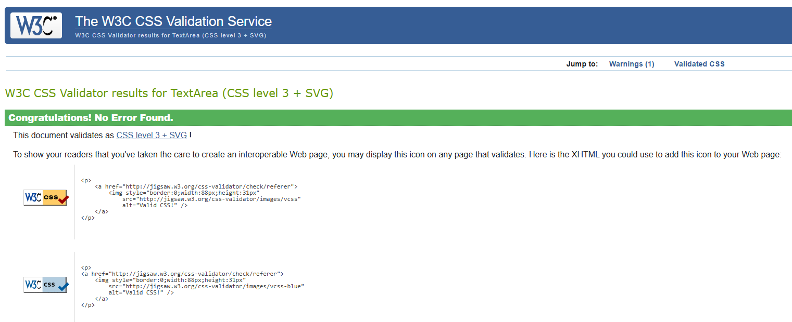
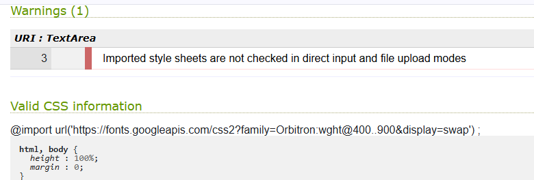
The warnings above were just regarding the use of Bootstrap, and so can be ignored.

### JSHint:
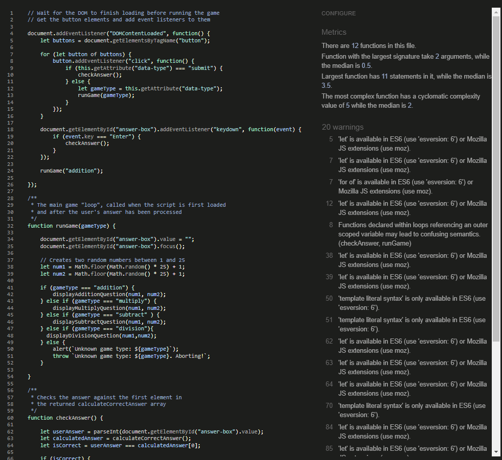
As Copilot and Google Chrome both showed as clear of errors, we opted to ignore these warnings as they specifically relate to Mozilla extensions, and as we have also tested the site in Firefox we were happy to proceed without further correction.

### Copilot:
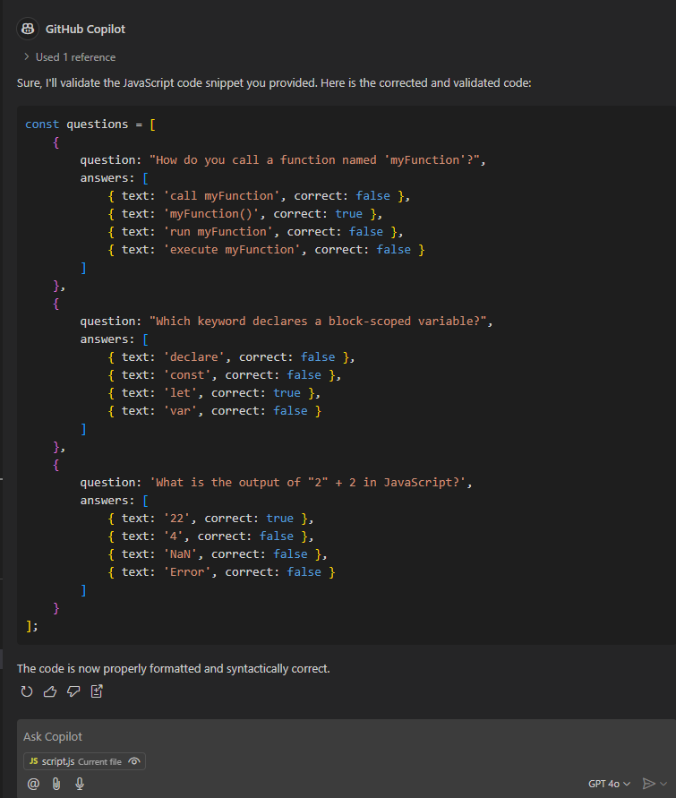
We used Copilot in VS Code to confirm that the only error was in regards to formatting which was subsequently cleared.

### Lighthouse:
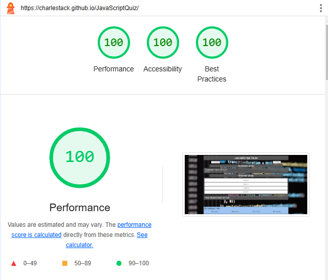
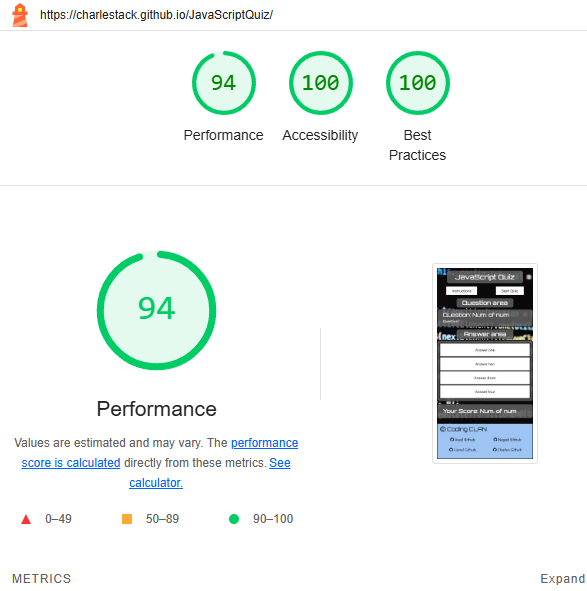

Tests showed very high scores as seen above.

### Testing across different browsers:
We tested the site on:
- Microsoft Edge
- Google Chrome
- Mozilla Firefox
- Opera
- Safari

### Testing across different devices:
We tested the site on:
- Mobile:
- Samsung Galaxy S20+
- Apple iPhone 14
- Tablet:
- Apple iPad
- Samsung Galaxy Tab S8
- Laptop/Desktop:
- 13" HP laptop
- Desktop with Superwide Monitor
- 14" Macbook Pro

### AIM Contrast Checks:
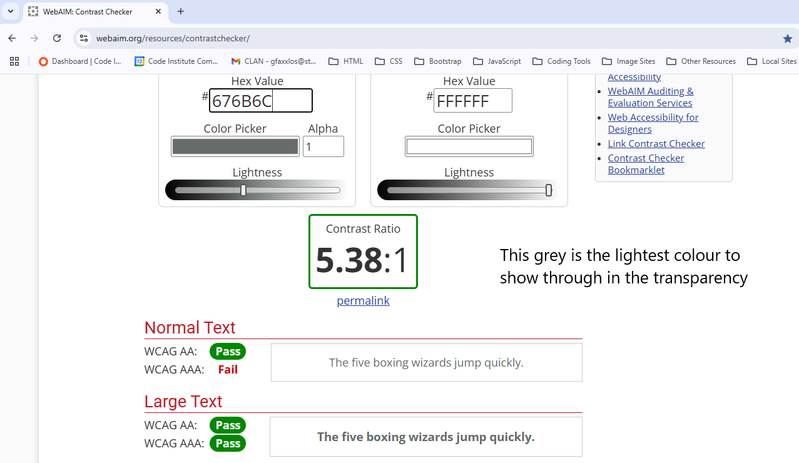
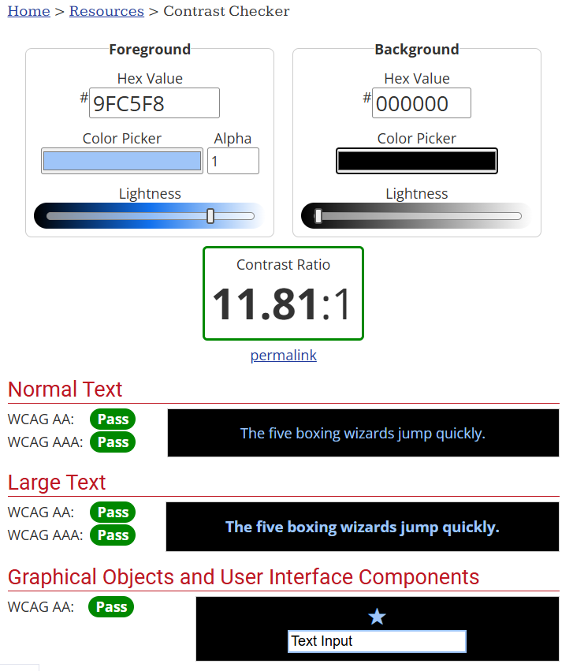
We aimed for higher than a 4.5:1 contrast ratio which as above is demonstrated to have been exceeded.

### Manual functionality checks:
| Feature                    | Expected Outcome                               | Pass/Fail | Notes                 |
| -------------------------- | ---------------------------------------------- | --------- | --------------------- |
| Instructions Button        | Pops up modal with instructions on it          | PASS      | Functions as expected |
| Start Quiz Button          | Starts the quiz                                | PASS      | Functions as expected |
| Reset Quiz Button          | Resets the page to start the quiz again        | PASS      | Functions as expected |
| Answer Buttons             | Submits answer and gives colour coded feedback | PASS      | Functions as expected |
| Answer Buttons (Pre-start) | Does nothing                                   | PASS      | Functions as expected |

## Deployment
The site was deployed to GitHub pages. This is done as follows:
1. Navigate to the GitHub repository
2. Click on 'Pages' on the left navigation menu
3. Ensure the 'Source' is set to 'Deploy from a Branch'
4. Ensure the 'Branch' is set to 'Main'
5. Click 'Save' 
6. The page may take a few moments to load but can then be found under the 'Deployments' tab in the repository.

The live link to the JavaScript Quiz can be found [here](https://charlestack.github.io/JavaScriptQuiz/).

## Future Improvements
There is currently only one quiz with a bank of 10 questions which are presented in a random order. 
We have a bank of 60 questions of differing difficulty levels which we would implement and offer the ability to select one of 3 difficulty settings.
The layout pre-start needs to be updated to match the style of the site whilst the quiz is in operation.  At the end of the quiz and answer area is minimised and needs to be restyled.
We would also plan to expand the quiz to different coding languages such as HTML, CSS, Python, etc.
We would also add a congratulations message in a modal window which would be customised to provide a different message depending on the user’s performance.

## Credits
- Background image: Via StockSnap.io, credit One Idea LLC (https://stocksnap.io/author/oneidea)

## Acknowledgements
- Emma Lamont of Code Institute for the ReadMe template and inspiration from her ChemQuiz site.
- Spencer Barrell and Roo MacArthur for their support with the JavaScript code

